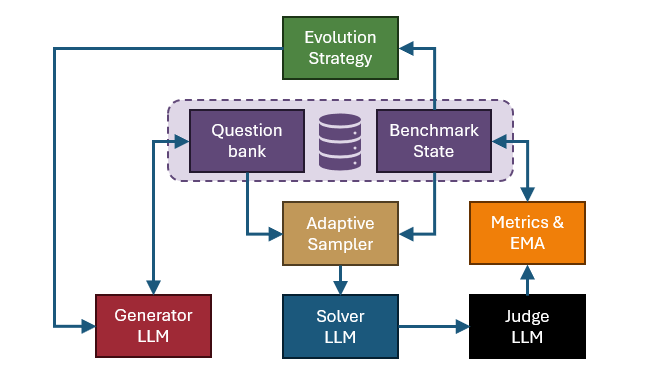
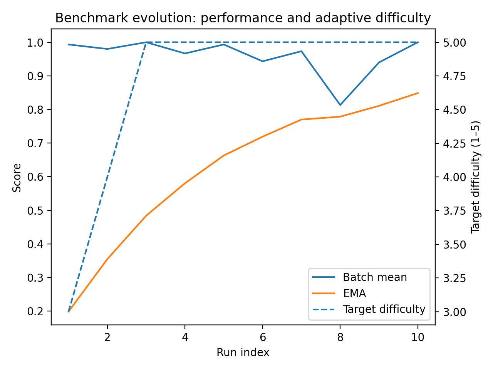
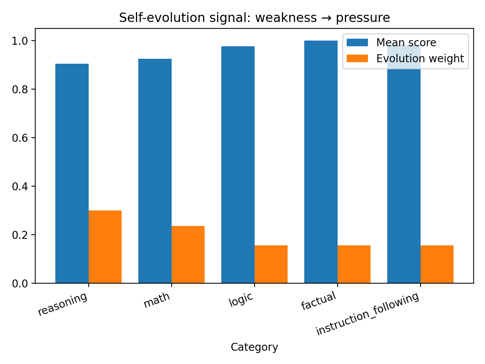
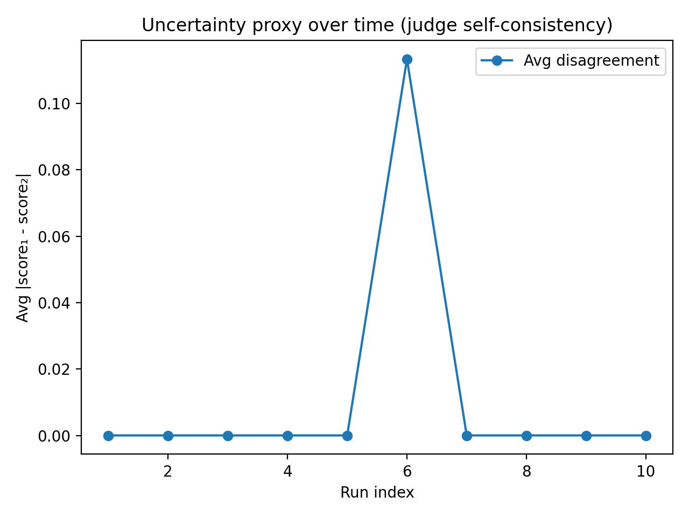
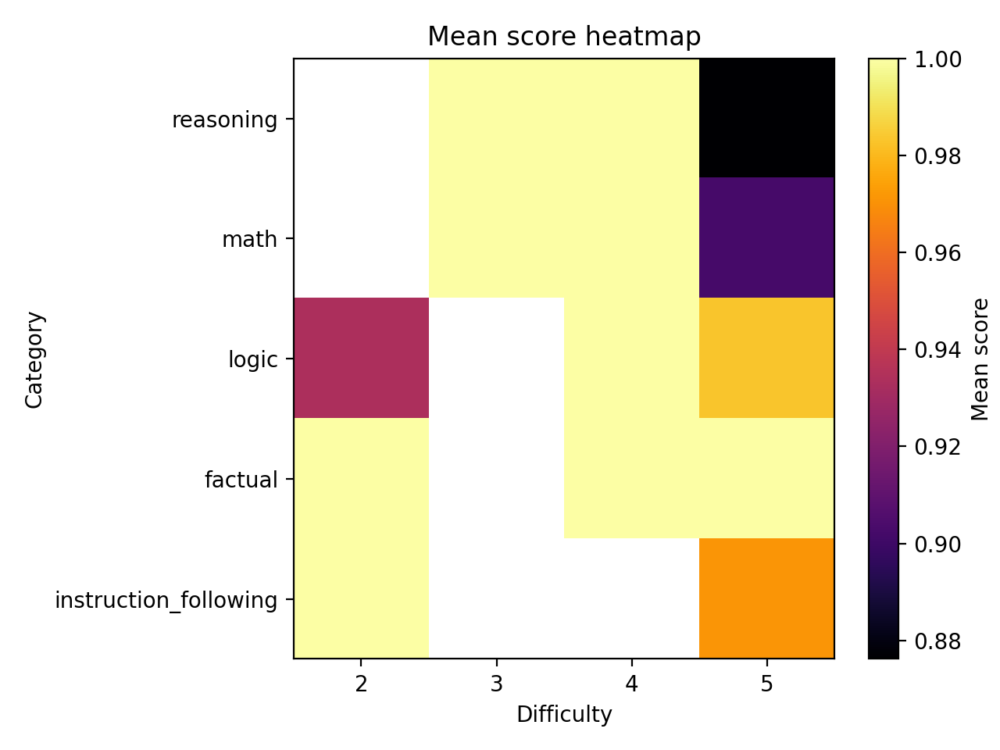

# Self-Evolving LLM Benchmark Generator

## Overview

This project implements a **self-evolving benchmark generator** for evaluating OpenAI-compatible large language model (LLM) endpoints. The system operates as a closed-loop evaluation framework:

1. Generate novel benchmark questions  
2. Evaluate model responses  
3. Track performance using an Exponential Moving Average (EMA)  
4. Adapt future generation and sampling based on observed weaknesses  

The result is an adaptive benchmarking system that continuously probes model behavior through input/output observation, without requiring access to model internals.

This design treats model evaluation as an iterative control process: apply inputs, observe outputs, estimate performance, and update the probing strategy accordingly.


## Key Features

- OpenAI-compatible endpoint support (generation, solving, judging)
- Guaranteed question novelty enforcement
- Category-aware adaptive sampling
- Dynamic difficulty targeting
- Exponential Moving Average (EMA) performance tracking
- Lightweight uncertainty proxy via judge disagreement
- Iterative evolution mode (`iterate`)
- Regression export capability
- Fully reproducible CLI workflow


## System Architecture

The system is organized as a closed-loop adaptive evaluation pipeline.

<p align="center">
  
</p>

### Components

#### Evolution Strategy

The Evolution Strategy module determines how the benchmark evolves over time.  
It reads historical performance signals from the Benchmark State and adjusts:

- Category generation weights  
- Target difficulty  
- Optional failure themes  
- Sampling priorities  

This component makes the system self-adaptive rather than static.

#### Generator (LLM)

The Generator produces new benchmark questions using an OpenAI-compatible endpoint.

- Reads prior prompts from the Question Bank to enforce novelty
- Adapts generation based on signals from Evolution Strategy
- Inserts newly generated questions into the Question Bank


#### Question Bank

The Question Bank stores all generated benchmark questions along with metadata such as:

- Category
- Difficulty
- Timestamp
- Prompt text

Questions are never deleted, enabling traceability and regression analysis.

#### Benchmark State

The Benchmark State stores dynamic evaluation information, including:

- Per-question evaluation results
- Judge scores and breakdowns
- Confidence signals
- Run-level batch means
- Exponential Moving Average (EMA)

Together, the Question Bank and Benchmark State form the persistent Benchmark Database.


#### Adaptive Sampler

The Adaptive Sampler selects which questions to evaluate in each run.

It reads from both:
- Question Bank
- Benchmark State

Sampling balances:
- Exploration (unevaluated or under-evaluated questions)
- Coverage (across categories)
- Exploitation (focus on weaker categories)

This ensures efficient use of evaluation budget while maintaining diagnostic power.

#### Solver (LLM)

The Solver endpoint answers sampled benchmark questions.

It receives the prompt and produces a model-generated response.

#### Judge (LLM)

The Judge evaluates the Solver’s response conditioned on the original question.

It outputs structured scoring information including:

- Scalar score
- Rubric breakdown
- Confidence estimate
- Optional disagreement signal

#### Metrics & EMA

The Metrics & EMA module aggregates judge outputs and updates:

- Batch mean score
- Exponential Moving Average (EMA)
- Category-level performance statistics

These metrics are written back to the Benchmark State and fed into the Evolution Strategy, closing the adaptive loop.


### Closed-Loop Flow

The full cycle operates as:

Evolution Strategy → Generator → Question Bank → Adaptive Sampler → Solver → Judge → Metrics & EMA → Benchmark State → Evolution Strategy  


## Adaptive Mechanics

### Self-Evolution Mechanism

The system adapts along three primary axes:

**Category Focus**  
Categories with lower observed mean scores receive higher generation weight, increasing pressure where the model underperforms.

**Difficulty Targeting**  
Target difficulty is adjusted dynamically based on EMA trends and category-level performance.

**Adaptive Sampling**  
Each run balances:
- Exploration (unevaluated or under-evaluated questions),
- Category coverage,
- Exploitation (weakness-focused evaluation).

This creates a controlled exploration–exploitation balance.


### Exponential Moving Average (EMA)

Instead of relying on raw batch means, performance is tracked using:

$$
EMA_t = \alpha \cdot batch\_mean_t + (1 - \alpha) \cdot EMA_{t-1}
$$


Benefits:

- Reduces variance between batches
- Smooths stochastic evaluation noise
- Enables drift detection over time
- Provides a stable signal for adaptation


### Uncertainty Proxy

The judge returns:

- Scalar score
- Rubric breakdown
- Confidence estimate
- Optional disagreement metric

Aggregate disagreement across runs provides a lightweight proxy for evaluation uncertainty and task ambiguity.


## Installation

```bash
conda create -n selfbench python=3.11
conda activate selfbench
pip install -r requirements.txt
```

Create a .env file for your API key:

```bash
OPENAI_API_KEY=your_key_here
```

## Quick Start

Initialize database:

```bash
python -m scripts.bench init
```

Single evolve step:

```bash
python -m scripts.bench all --n-gen 5 --n-run 5
```

Iterative evolution:

```bash
python -m scripts.bench iterate --iterations 10 --n-gen 10 --n-run 15 --alpha 0.2
```

Analyze results:

```bash
python -m scripts.bench analyze
```

Explore results:

```bash
python -m scripts.bench visualize
```

## Results & Diagnostics

The following stress-run demonstrates adaptive dynamics:

```bash
python -m scripts.bench init
python -m scripts.bench iterate --iterations 10 --n-gen 5 --n-run 5 --alpha 0.2
python -m scripts.bench visualize
```

The generated visualizations from the persisted SQLite state are as follows:

- **Benchmark evolution:** EMA smooths batch noise while target difficulty adapts over time.
<p align="center">
  
</p>

- **Category pressure:** weaker categories receive higher sampling/generation pressure.
<p align="center">
  
</p>

- **Judge disagreement:** lightweight uncertainty proxy (higher = more ambiguous / unstable evaluation).
<p align="center">
  
</p>

- **Heatmap:** identifies category×difficulty pockets where the solver degrades.
<p align="center">
  
</p>


## Design Rationale

### Closed-Loop Evaluation

Evaluation is modeled as a feedback system rather than a one-time scoring task. Performance metrics directly influence future question generation and sampling decisions. This enables continuous refinement instead of static benchmarking.

### Budget-Aware Sampling Strategy

As the question bank grows, evaluating the entire bank at each iteration becomes inefficient. The system instead prioritizes:

- Unevaluated or under-evaluated questions
- Category coverage to maintain signal balance
- Weak categories for targeted stress testing

This preserves computational efficiency while maintaining diagnostic power.

### Persistent Benchmark History

Questions are not deleted, even if trivial. Maintaining historical data enables:

- Regression tracking
- Drift analysis
- Traceability across iterations

Sampling naturally deprioritizes trivial items without destructive removal.

### Endpoint-Agnostic Design

The system operates on any OpenAI-compatible endpoint. Generation, solving, and judging are decoupled from model internals, allowing flexible deployment across model versions and providers.

### Modular Separation of Concerns

The system explicitly separates:

- Question generation
- Sampling
- Evaluation
- Metric aggregation
- Evolution logic

This modularity improves maintainability, traceability, and extensibility.


## Limitations

- **Single-judge bias:** Evaluation relies on a single LLM judge. Although lightweight self-consistency is used (low-confidence rejudge + disagreement proxy), systematic bias in the judge model may influence scoring.

- **Self-play coupling:** When generator and judge share similar model families, question difficulty may implicitly align with evaluator strengths, potentially underestimating blind spots.

- **Synthetic task distribution:** Generated questions may not fully reflect real-world task distributions. The benchmark probes model behavior under synthetic stress, not empirical deployment data.

- **Exact novelty enforcement:** Novelty is enforced via hash-based deduplication and prompt-level constraints. Semantic similarity filtering is not currently implemented.

- **Difficulty calibration:** Difficulty levels are generator-estimated rather than psychometrically calibrated or human-validated.

- **Endpoint dependence:** Observed performance and adaptive dynamics depend on the chosen solver model and API configuration.


## Future Extensions

- **Multi-judge ensemble scoring:** Aggregate scores across heterogeneous judge models to reduce bias and improve robustness.

- **Semantic novelty filtering:** Incorporate embedding-based nearest-neighbor checks to prevent semantically similar questions.

- **Adversarial difficulty shaping:** Introduce explicit failure-mining or solver-aware adversarial generation loops to target blind spots more aggressively.

- **Curriculum scheduling:** Formalize difficulty adjustment as a multi-objective optimization problem balancing novelty, difficulty, and uncertainty.

- **Benchmark freezing for regression testing:** Support periodic snapshotting of high-signal questions into stable regression suites.

- **Human-in-the-loop calibration:** Incorporate occasional human review to anchor difficulty and scoring validity.

- **Domain-specialized modes:** Enable plug-in domain templates (e.g., code reasoning, math, planning, instruction-following).

- **Cross-model benchmarking:** Support systematic evaluation across multiple solver models for comparative analysis.

